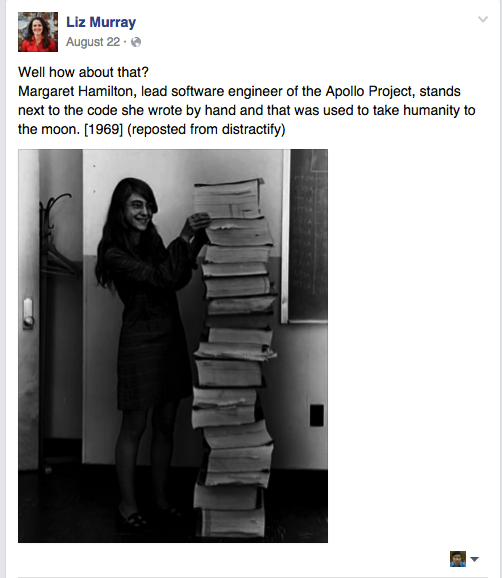
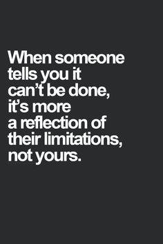
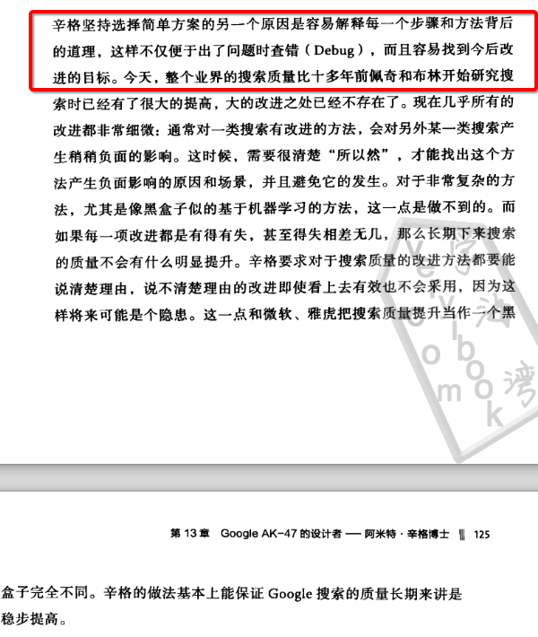
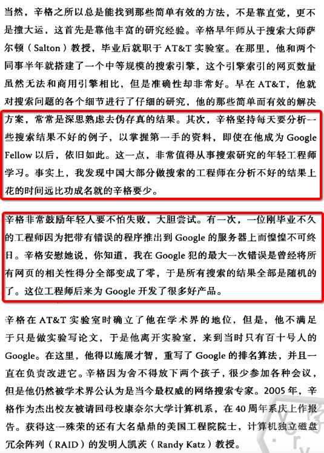

# Attitude
This folder is for attitude

##谈坚持
* 日复一日、滴水穿石的坚持。    
* “水喝多了，尿自然就有了”。
* 不要立刻去要求回报，无论是做技术还是做人都是这样。  
* 好书很多，好资源也很多，关键不在于多么牛X的方法，而是日复一日、滴水穿石的坚持！  
* 从小事做起，每一个点位都应当亲自做一遍。不能因为太小的事情而不做。  
* 一步一步的将所有可能的例子做一遍。
* 要将你的梦想贴在床头和电脑桌前----**Very important!!**
* 你今天努力去做的事情，是为以后的几年或者十年后做基础。
* 让积累变成一种习惯 (http://thecodesample.com/)

##谈过程和思路
* 什么东西你最排斥，感觉最不想做－－ 去做，这才是你变强大的关键。
* 选择 不做 什么，比做什么更重要。    
* 多注意培养解题思维，这个是要刻意去做的。  
* 枯燥无味，是正常的，经受枯燥岁月的磨砺才能更强。
* 要了解获胜关键，要在关键问题上不含糊。
* 勤奋深入思考比单纯卖力勤奋重要100倍。
* 永远不要纠结怎么做到，去做～ 简化，让行动带动思维和人生。洒脱！
* 强者都是说，这算什么。。。做不到的，都是因为自己怀疑做不到，你去做，不要去停留在怀疑，去做，去做，去做! That it(IT)!
* 如果你真想得到，你必须永不放弃。放弃的人永不成功，成功的人永不放弃。
* 永远不要伤心，只有快乐，很快乐，非常快乐，去做，去做，去做，去经历，去经历，去经历，去感受，去感受，去感受！
* 重要的事情要做多遍，对于基础，要打牢固，就要做多遍，去检验，去总结。
* 做人做事，要结合自己的节奏～要掌控好节奏。
* 人要有智慧的去处理问题。没有机会的时候按兵不动，有机会的时候全力出击。
* 思维模式，行为模式，深入影响你的生活。

##谈方向
* 机不可失，失不再来－－永远牢记－－如果有机会一定要全力以赴。 全力以赴的基础是 储备。
* 如果你不列计划，不去实施，这个事情99%不会发生。更坏的是，可能99%掌握在另外一个你的敌人手中。
* 注意对事情的判断准确度，并不断修正。
* 提正确的问题，才说明你在正确的方向。
* 做他人做不到的事情，这个才真正定义了你自己的价值。 别人做不到的东西，才真正是机会。－－谈真正的做大事的人，以及如何成功。
* 多读书，读好书，再忙也要多读书。
* 对成功的渴望虽然极为重要，并不能真正使人成功，正确的方向，正确的努力，捕捉到良好的时机，才能使人成功。
* 短期利益和长期利益取舍，另外牢记不可有害人之心，但不可无防人之心。
* 走别人没走过的路，让别人有路可走。
* 记住：只有自己幸福，才能让别人幸福。人生有痛苦，但是我们绝对不是来创造痛苦的。我们要让自己幸福，同时让别人幸福。积极思考遇到的一切问题，学会感激。感激能带给人类最单纯的快乐。即使有些事情，你思考不到任何积极的原因，你也要选择接受。生活不是直线上升的，怎么会一帆风顺？不要期待一帆风顺，要训练铁打的能力，积极的面对生活中的困难。

你要专心仰仗耶和华，不可仰仗自己的聪明－－－》时常这样想，就能心平气和，常怀感恩心，谦卑谨慎的做事情。圣经是智慧结晶。

