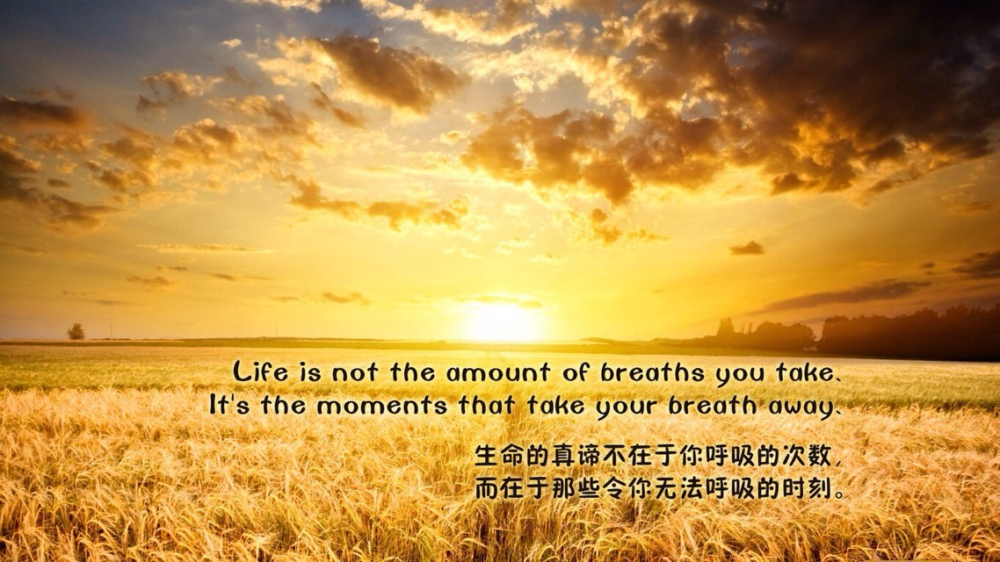

# Attitude
This folder is for attitude

##血的教训
* 人生没有后悔药。
* 永远不要和 傻瓜 争辩，永远不要和 傻瓜 斗气。斗争，绝不能合理解决问题，情绪和冲动是魔鬼。
* 你对一个人的 ”定位“，决定了你的 ”期待“，当你的 ”期待“，无法被达到，则这会 ”牵动“ 你的情绪，你的情绪则最终导致 你与其他人的关系失衡。内心失衡，抑或关系失衡，最终都会导致痛苦和错误。 期待，才是真正的杀手。

##谈过程和思路
* 做工程也好，做人也好，不要 “依赖于他人”， 摆脱 “依赖心理”，这个世界你能依赖的就是你自己，认真分析，做决定，做了决定就要自己承担后果，不要遗憾和后悔。错误是正常的，没有人能够永远正确。快速恢复。
* 当一条路走不通，要迅速调整，迅速调整到另一个方法中，不要沉浸在失败中，失败是暂时的，调整方法和方式，快速调整方法和方式非常重要。不要钻牛角尖！！！要迅速面对现实，改变思路。想要去做到的事情，就要永不放弃，努力尝试。
* 我想说：失败不是什么丢人的事情，从失败中全无收获才是。
* 什么东西你最排斥，感觉最不想做－－ 去做，这才是你变强大的关键。
* 选择 不做 什么，比做什么更重要。    
* 多注意培养解题思维，这个是要刻意去做的。  
* 枯燥无味，是正常的，经受枯燥岁月的磨砺才能更强。
* 要了解获胜关键，要在关键问题上不含糊。
* 勤奋深入思考比单纯卖力勤奋重要100倍。
* 永远不要纠结怎么做到，去做～ 简化，让行动带动思维和人生。洒脱！
* 强者都是说，这算什么。。。做不到的，都是因为自己怀疑做不到，你去做，不要去停留在怀疑，去做，去做，去做! That it(IT)!
* 如果你真想得到，你必须永不放弃。放弃的人永不成功，成功的人永不放弃。
* 永远不要伤心，只有快乐，很快乐，非常快乐，去做，去做，去做，去经历，去经历，去经历，去感受，去感受，去感受！
* 重要的事情要做多遍，对于基础，要打牢固，就要做多遍，去检验，去总结。
* 做人做事，要结合自己的节奏～要掌控好节奏。
* 人要有智慧的去处理问题。没有机会的时候按兵不动，有机会的时候全力出击。
* 思维模式，行为模式，深入影响你的生活。

##谈坚持
* 日复一日、滴水穿石的坚持。    
* “水喝多了，尿自然就有了”。
* 不要立刻去要求回报，无论是做技术还是做人都是这样。  
* 好书很多，好资源也很多，关键不在于多么牛X的方法，而是日复一日、滴水穿石的坚持！  
* 从小事做起，每一个点位都应当亲自做一遍。不能因为太小的事情而不做。  
* 一步一步的将所有可能的例子做一遍。
* 要将你的梦想贴在床头和电脑桌前----**Very important!!**
* 你今天努力去做的事情，是为以后的几年或者十年后做基础。
* 让积累变成一种习惯 (http://thecodesample.com/)

##谈方向
* 机不可失，失不再来－－永远牢记－－如果有机会一定要全力以赴。 全力以赴的基础是 储备。
* 如果你不列计划，不去实施，这个事情99%不会发生。更坏的是，可能99%掌握在另外一个你的敌人手中。
* 注意对事情的判断准确度，并不断修正。
* 提正确的问题，才说明你在正确的方向。
* 做他人做不到的事情，这个才真正定义了你自己的价值。 别人做不到的东西，才真正是机会。－－谈真正的做大事的人，以及如何成功。
* 多读书，读好书，再忙也要多读书。
* 对成功的渴望虽然极为重要，并不能真正使人成功，正确的方向，正确的努力，捕捉到良好的时机，才能使人成功。
* 短期利益和长期利益取舍，另外牢记不可有害人之心，但不可无防人之心。
* 走别人没走过的路，让别人有路可走。
* 记住：只有自己幸福，才能让别人幸福。人生有痛苦，但是我们绝对不是来创造痛苦的。我们要让自己幸福，同时让别人幸福。积极思考遇到的一切问题，学会感激。感激能带给人类最单纯的快乐。即使有些事情，你思考不到任何积极的原因，你也要选择接受。生活不是直线上升的，怎么会一帆风顺？不要期待一帆风顺，要训练铁打的能力，积极的面对生活中的困难。

* 注重思路上的清晰，做题目的总结。  不要搞“题海”战术。
* 我们今天想不通的问题，努力去思考，积累，总有一天我们站的高度到了，就想通了。
* 我们今天觉得难的事情，一步一步走下去，越走路就越宽，眼界就更广了，就易了。

##谈志气
* 做事情，勇于超出别人的期待
* 敢为人先，年轻的时候不要怕失败
* 做他人做不到的事情，这个才真正定义了你自己的价值。 别人做不到的东西，才真正是机会。－－谈真正的做大事的人，以及如何成功。
* 强者都是说，这算什么。。。做不到的，都是因为自己怀疑做不到，你去做，不要去停留在怀疑，去做，去做，去做! That it(IT)!
* 机不可失，失不再来－－永远牢记－－如果有机会一定要全力以赴。 全力以赴的基础是 储备。
* 一个优秀程序员抵得上100个普通程序员

##谈为人处事
* 多自省，多修正。人必修于内而发于外
* 淡定，克制，镇静，又不失为人的热情。
* 待己以严，待人以宽。做人成功在大气，失败在计较。心胸要宽广，志存高远。

##谈信心
* 信心 来源于 坚实的基础，日复一日的坚持的积淀
* 信心，来自于内心中 长久以来的信念，信仰，价值观。

##谈全局观
* 不要被细小的事情牵扯住，要看大局，部分东西可以先忽略，先做结构上很重要的事情，在回来做细节上的事情。 －－－－》 编程也一样，不要盯在某个小问题如何解决上，小问题当然要解决，但是结构很重要。    做大事者不拘小节 的一个方向上的解读。

你要专心仰仗耶和华，不可仰仗自己的聪明－－－》时常这样想，就能心平气和，常怀感恩心，谦卑谨慎的做事情。圣经是智慧结晶。

##谈智慧
* 永远不要试图与傻瓜争辩。特别是说服傻瓜，or 说服在气头上的人。
* 不要为过去遗憾，因为那是过去。
* 过度关注自己的情绪感受，过度关注事情的细节，容易忽略事情的全局，全景，看不清事实。
* 永远保持笑容，因为比你惨的人大有人在，你的微笑能够治愈自己，也能够治愈别人。why not？
* 如果不要对一些人有期待，就不会有过度的伤害。无欲则刚。如果你有 “过度期待”，那是你 “预判” 不对，是你对事情中 “关系” 没有看清楚，对在这件事中每一个东西或者人的 “定位” 不准确 造成的。在这个时候，找准自己的位置，非常关键。
* 一个人处理自身认为的 “消极事件” 的能力，区分其智慧水平。人与人的差距不在于处理顺境的能力，在于处理各种想到的想不到的逆境的能力。
* 能够接受不能改变的事情，努力改变能够改变的事情，拥有智慧去区分上述两类事件。

Great hopes make great man.
大希望造就大人物。

The two most powerful warriors are patience and time.
时间与耐心是最强大的两个战士。

Celebrate your gifts, enjoy them, but don' t take pride in them, take pride in your decision and hardwork.
庆幸你的天赋并好好利用吧，但不要因为天赋而沾沾自喜，应该为自己的勤奋和决断而自豪。

要对生活和技术充满想象力：
